# Report

Wrote this report aiming to perform a complete investigation based on threats that happened in the Wazuh SOC Analyst playlist.

---

## Findings (What did i find)

- **System Discovery Activities (MITRE T1033 / T1016 / T1087 / T1018):** Execution of standard enumeration commands across both Windows and Linux endpoints (`whoami`, `ipconfig /all`, `net user`, `net localgroup administrators`, `ip a`).

- **Default Accounts and Account Manipulation (MITRE T1078.001 / T1098):** The default disabled local `Guest/Convidado` account was enabled (`/active:yes`) and assigned a new password.

  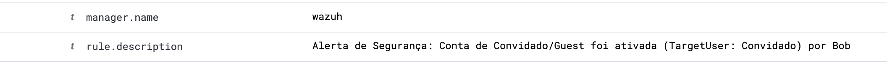

  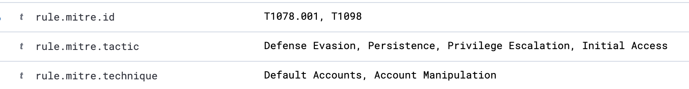

  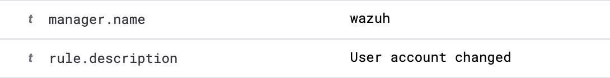

  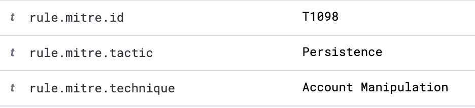

- **Local Account Creation, Privilege Escalation & Account Access Removal (MITRE T1136.001 / T1098 / T1531):** A user account (`student1`) was created, added to the local `Administrators` group, and subsequently deleted.
    

  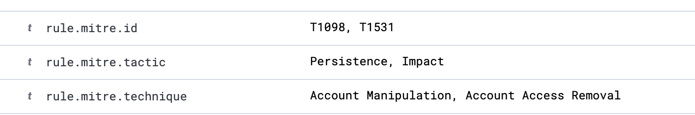

- **Sensitive File Access & Local Data Staging (MITRE T1552.001 / T1074.001):** Inspection of `/etc/passwd` on the Linux target and redirection of its content to a staging file (`/tmp/loot.txt`).
    - Direct command execution on Linux bypassed process telemetry due to lack of `auditd` system call monitoring. However, the resulting artifact was captured as a file addition event via File Integrity Monitoring (FIM Rule 554).
    

  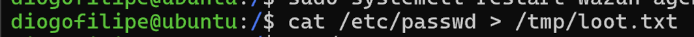

  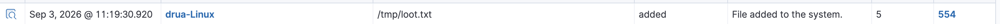

- **SSH Brute-Force and Password Guessing (MITRE T1110.001):** Interactive SSH session via account `diogofilipe` followed by multiple failed password attempts.

  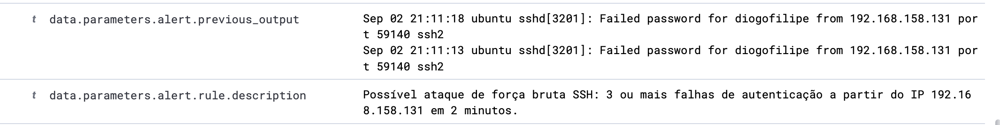

  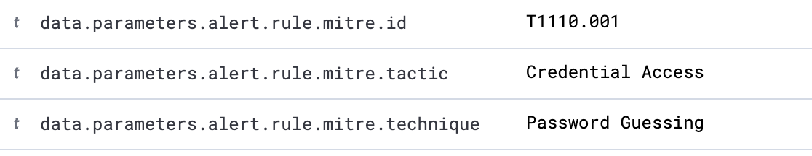

- **Detection Controls & Active Response Validation:** Implementation of File Integrity Monitoring (**FIM**), custom detection rules (`local_rules.xml`), and dynamic containment via Wazuh Active Response (`firewall-drop` via `iptables`).
    - **FIM**: verified real-time integrity alerts for file creation, modification, and deletion across monitored directories on both Windows and Linux endpoints.
        - Windows:

  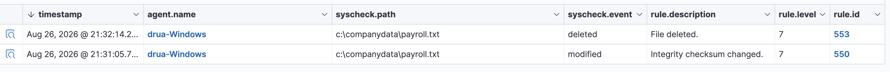

        - Linux:

  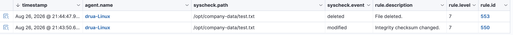

---

## Investigation Summary (What happened)

### Who (Who was involved?)

- **Source Host / Operator:** Windows Endpoint (`192.168.158.131` / `Bob`).
- **Target Systems:** Ubuntu Server (`192.168.158.130`).
- **Accounts Involved / Manipulated:**
    - `Guest` (Reactivated and modified).
    - `student1` (Temporary local administrator created and deleted).
    - `diogofilipe` (Target account for SSH brute-force validation).

### What (What happened?)

1. **Windows Discovery & Privilege Abuse:** Native administrative utilities were executed to map network and user configurations. The `Guest` account was enabled, and a secondary administrator account (`student1`) was created, added to the `Administrators` group, and later deleted.
2. **Lateral Movement & Credential Access (Linux):** SSH traffic originated from the Windows host to the Linux target (`192.168.158.130`). An interactive session was established as `diogofilipe`, extracting `/etc/passwd` to `/tmp/loot.txt`.
3. **SSH Brute-Force and Password Guessing:** Initiated an SSH connection targeting user `diogofilipe` with three consecutive failed authentication attempts within two minutes to breach detection thresholds.
4. **Detection Engineering & Automated Mitigation:**
    - Custom rule deployed to alert on `Guest`/`Convidado` account activation.
    

  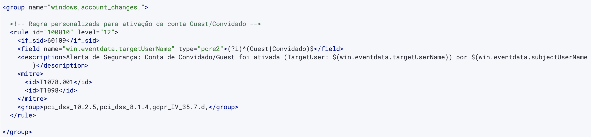

    
    - Timeframe-based correlation rule created for SSH brute-force (3 failures in 120s using `<if_matched_sid>5710</if_matched_sid>` and `<same_source_ip />`).
    

  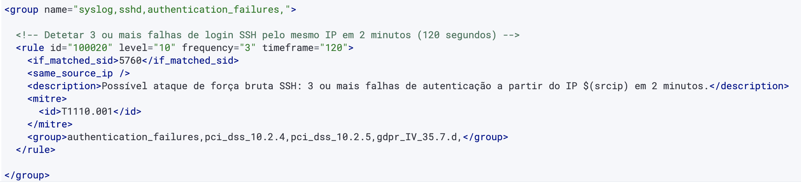

    
    - Active Response triggered `firewall-drop`, applying dynamic `iptables` drop rules against the offensive IP.
    

  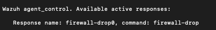

    

  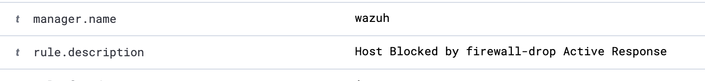

    

  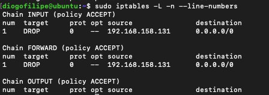

### When (When did this occur and is it still happening?)

  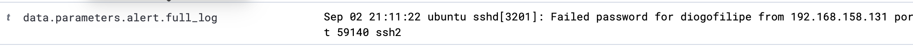

- **Status:** Contained and resolved. Offensive traffic was dropped by Active Response, verified by ICMP ping timeouts.

  

  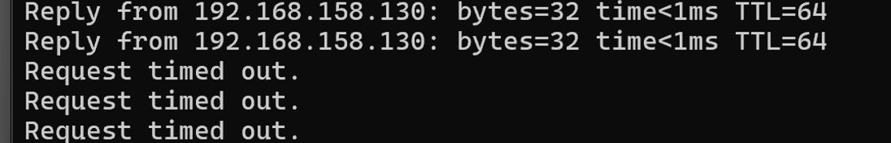

### Where (Where in the environment did this happen?)

- **Windows Endpoint:** Virtual Machine (`192.168.158.131`).
- **Linux Endpoint:** Ubuntu Server Virtual Machine (`192.168.158.130`).
- **Central Monitoring:** Wazuh SIEM Manager.

### Why (Why did this happen?)

- Controlled adversary emulation exercise designed to evaluate SIEM visibility, validate custom ruleset efficacy, and verify automated threat containment via Active Response.

### How (How did this happen?)

- Leveraged native OS tools (*Living off the Land* binaries such as `cmd.exe`, `powershell.exe`, `net.exe`, native `ssh` client) and standard Linux shell utilities.

---

## Recommendations

- **Automate Host-Based Containment:** Keep Wazuh Active Response (`firewall-drop`) enabled to drop brute-force sources dynamically via `iptables`.
- **Enforce Local Account Hardening:** Disable the `Guest` account centrally via Group Policy (GPO) to prevent unauthorized reactivation, and configure high-severity alerts (Level 10+) for local group membership modifications (Windows Event IDs 4720, 4728, 4732).
- **Harden SSH Service:**
    - Disable password authentication in `/etc/ssh/sshd_config` (`PasswordAuthentication no`) in favor of public key authentication.
    - Restrict SSH access using firewall rules or management access control lists (ACLs) to block port 22 from general workstation segments.
- **Maintain File Integrity Monitoring (FIM):** Monitor critical directories (`/etc/`, `/tmp/`, system binary paths) for unauthorized modifications or staging behaviors.
- **Bridge Visibility Gaps (Detection Tuning):** Create rules for process creation telemetry (Sysmon Event ID 1 / Windows 4688) to capture Living-off-the-Land discovery binaries (`whoami.exe`, `ipconfig.exe`, `net.exe`).
